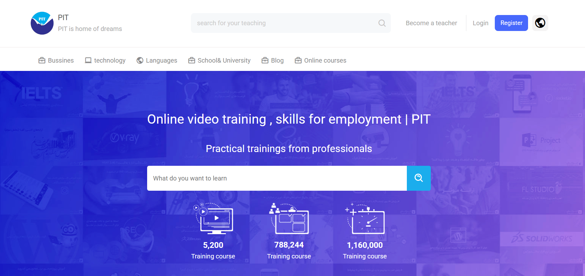

# 🎓 Education Website

A responsive **education landing page** built using **HTML** and **CSS**.
This project demonstrates a clean and modern layout for an online learning platform, including course sections, hero banners, and informational content.

---

## 🚀 Live Demo

🔗 https://education-website-pit.vercel.app/

---

## 🖼 Screenshot



---

## 🛠 Tech Stack

* **HTML5**
* **CSS3**
* **Responsive Design**
* **Vercel Deployment**

---

## ✨ Features

* 🎓 Modern education landing page UI
* 📱 Responsive layout for mobile, tablet, and desktop
* 📚 Course showcase section
* 🧭 Navigation menu and hero section
* 🎨 Clean UI design using pure CSS
* ⚡ Fast static website deployment on Vercel

---

## 📂 Project Structure

```
Education-website-pit
│
├── index.html
├── style.css
├── font
├── images
│
└── assets
```

---

## ⚙️ Installation

Clone the repository

```bash
git clone https://github.com/pouyanfarsara/Education-website-pit.git
```

Go to the project folder

```bash
cd Education-website-pit
```

Open the project

```bash
open index.html
```

Or run using Live Server in VS Code.

---

## 🎯 Future Improvements

* Add JavaScript interactivity
* Add course filtering system
* Improve animations and UI effects
* Convert to React or Next.js version

---


GitHub
https://github.com/pouyanfarsara
